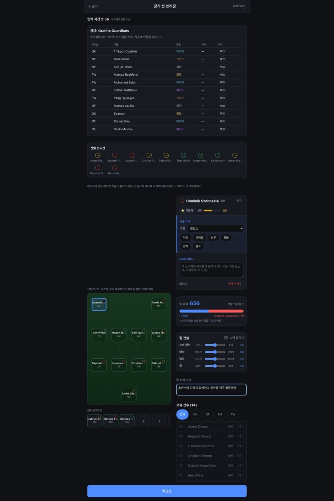
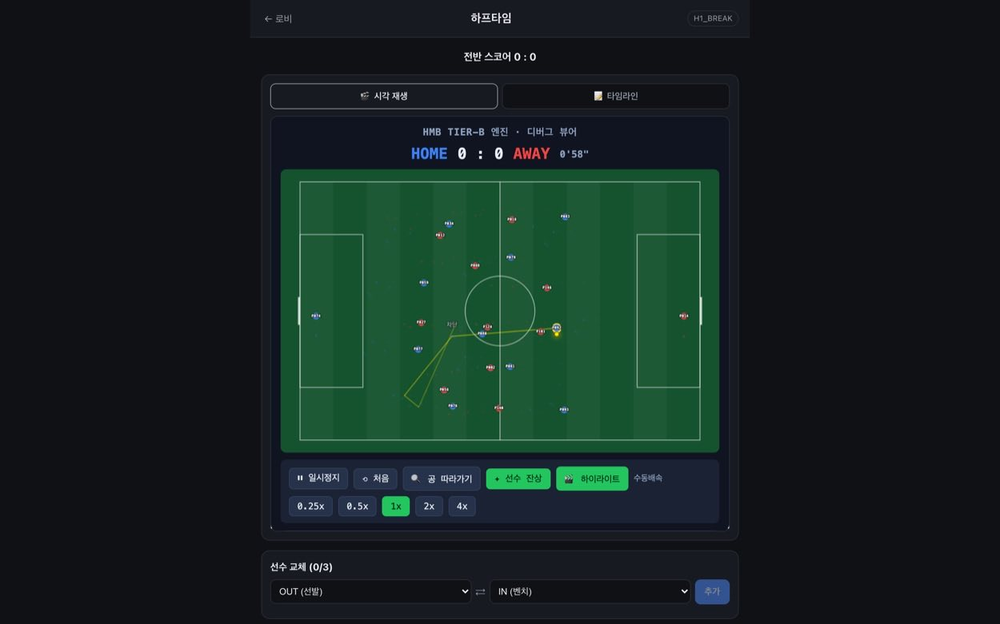
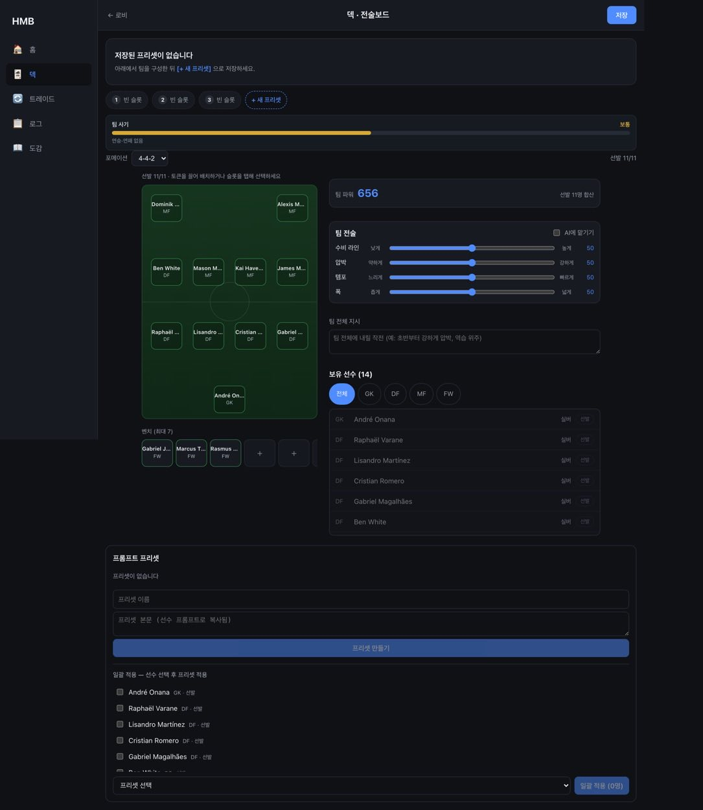
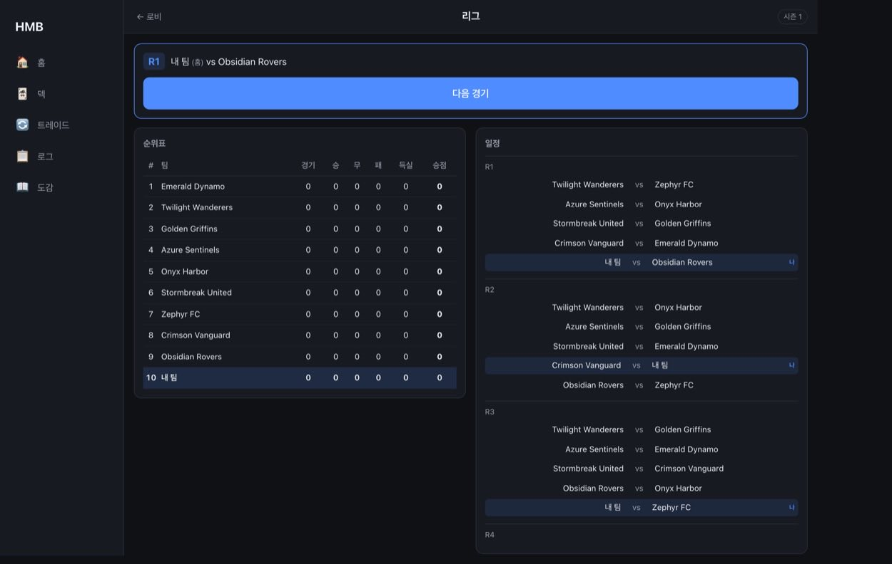

# HMB 온라인

> **슬라이더를 만지는 대신, 감독처럼 말로 지시한다.**
> AI 가 그 말을 선수별 행동 파라미터로 옮기고, 결정론 엔진이 22명이 실제로 움직이는 경기를 만든다.

[**▶ 지금 바로 플레이 — https://hmb-online.pages.dev**](https://hmb-online.pages.dev)

---

## 1. 게임 소개

### 이 게임은 무엇인가

**축구 매니지먼트 게임 + 선수 개개인에게 자연어 프롬프트.**

Football Manager 의 검증된 틀 위에, 유저가 선수 한 명 한 명에게 **문장으로** 지시를 내리는 것이
차별점인 웹 축구 시뮬 게임이다. 설치 없이 PC·모바일 브라우저에서 바로 돌아간다.

### 핵심 차별점 — 위젯이 아니라 문장이다

> "풀백은 사이드로 올라가 공격을 만들어라" · "상대 10번을 밀착 마크" · "무리하지 말고 실점 최우선"

슬라이더로는 표현이 안 되던 지시가, 피치 위에서 **다른 움직임**으로 나타난다.
슬라이더가 아니라 문장이라, **표현의 상한이 언어의 상한**이다.

| | |
|---|---|
| **1 — 말로 지시한다** | 경기 전 브리핑에서 선수마다 다른 문장을 적는다. 팀 전체 지시와 별개로, 선수별 "감독의 한마디" 가 있다. |
| **2 — 그 말이 움직임이 된다** | 선수가 피치 좌표를 갖고 1초 틱마다 인식·판단·실행한다. "침투해라" 와 "내려서 받아라" 가 서로 다른 움직임으로 보인다. |



*경기 전 브리핑. 오른쪽 패널의 "감독의 한마디" 가 선수 한 명에게만 걸리는 자연어 지시다.
상대 분석 · 선발 컨디션 · 포메이션 보드 · 팀 전술이 한 화면에 있다.*

### 한 경기가 흘러가는 방식

유저가 개입하는 창은 **경기 전**과 **하프타임** 두 번뿐이다. 관전 중에는 개입하지 않는다 —
그래야 "내 지시가 이 결과를 만들었다" 가 성립한다.

```
덱 구성 → 상대 분석 → 선수별 자연어 지시 → 킥오프
        → 관전(2D 실좌표 재생) → 하프타임 감독 시간(교체 ≤3 + 지시 수정) → 후반 → 결과·보상
```

- **한 경기 ≈ 10분** — 전·후반 재생 + 하프타임 감독 시간 3분. 짧은 여가에 한 판이 끝나는 길이.
- **시계는 서버가 쥔다** — 화면을 닫아도 경기는 진행되고, 다시 들어오면 "지금 시점" 으로 이어 본다.
- **자리를 비워도 멈추지 않는다** — 감독 시간이 만료되면 전반 지시를 승계해 후반이 자동으로 시작된다.
- **같은 경기가 100% 재현된다** — (시드 + 덱 + 지시 로그 + 엔진 버전) 만으로 언제든 같은 경기가 나온다.
  리플레이 · 부정 검증 · 문의 대응이 전부 여기서 나온다.



*관전 화면. 서버가 계산해 둔 90분을 클라이언트가 재생한다 — 배속 · 되감기 · 선수 잔상 · 하이라이트.
골 · 선방 · 파울이 상황 자막과 함께 연출되고, 타임라인 탭에는 같은 경기가 시간순 로그로 쌓인다.*

### 경기 밖에서 하는 것 — 모으고, 키운다

- **모으기** — 경기와 미션으로 모은 포인트를 영입(뽑기)에 쓴다. 등급 분포를 먼저 공개하고,
  결과는 5등급(BRONZE~LEGEND). 원하는 선수가 안 나오면 트레이드로 바꾸고, 도감에 쌓인다.
- **키우기** — 뛴 선수에게만 경험치가 들어간다. 레벨업 시 **상승폭이 서로 다른 세 선택지**가 열리고
  고르는 순간 값이 고정된다. **무엇이 후보로 뜨는지는 그 선수에게 걸어 둔 프롬프트가 정한다** —
  말로 시킨 대로 뛴 선수가 그 방향으로 자란다.



*덱 · 전술보드. 선발 11 + 벤치를 슬롯에 놓고, 팀 전술과 팀 전체 지시를 정한다.
자주 쓰는 문장은 프롬프트 프리셋으로 저장해 여러 선수에게 일괄 적용한다.*

### 계속 하게 만드는 것 — 시즌과 경쟁

- **리그** — 시즌 단위로 라운드를 치르고, 성적에 따라 **디비전 1~10단계**를 오르내린다.
  상대 난이도가 실력을 따라온다.
- **원정(비동기 PvP)** — 다른 감독이 저장해 둔 **실제 팀**에 쳐들어간다. 상대가 접속해 있지 않아도
  성립하고(저장된 덱 + 결정론 시뮬), 내가 없는 사이 내가 침공당하기도 한다.
- **기록 · 랭킹** — 승률 · 연승 · 모드별 전적이 쌓이고, 리그 순위와 원정 순위가 따로 매겨진다.
  경기가 끝나면 **내가 건 말이 어떤 장면으로 이어졌는지**가 선수별 평점과 로그로 남는다.



*리그 화면. 10팀 라운드로빈 시즌 — 순위표와 전 라운드 일정, 다음 경기 바로가기.*

### 어떻게 도는가

```
웹 (React · Cloudflare Pages)      화면 · 입력 · 2D 재생. 판정은 하지 않는다.
권위 서버 (Java · Spring Boot)      게임 흐름 · 상태 · 잡 큐 · 정산을 전부 소유한다.
서번트 2종 (TypeScript)             엔진 러너 · AI 실행기. 무상태로 호출만 받는다.

유저의 문장 → AI 가 행동 파라미터로 변환 → 결정론 엔진이 90분 계산 → 로그 저장 → 클라가 재생
```

**AI 는 인풋만 만들고 경기 자체에는 개입하지 않는다.** 매 틱 LLM 을 부르면 같은 경기가 두 번
다시 안 나오고 비용 · 지연도 감당이 안 된다. 인풋을 미리 만들고 시뮬을 결정론으로 두면
재현 · 검증 · 리플레이 · 향후 PvP 가 전부 따라온다.

> 위 화면은 전부 목업이 아니라 **돌아가는 빌드의 실화면 캡처**다.
> 캡처에 보이는 선수 이름은 개발 중 시드 데이터이며, 공개 빌드에서는 전량 가상 인물로 교체한다.

---

## 2. 로컬 빌드 — 내 머신에서 게임하기

클론 → 전제 확인 → 한 줄 → 브라우저. 세 프로세스(권위 서버·엔진 러너·AI 실행기)와 웹을
`scripts/local-stack.sh` 하나가 띄운다.

```bash
git clone https://github.com/dd0114/hmb-online.git
cd hmb-online
npm ci

bash scripts/local-stack.sh doctor   # 전제만 점검하고 끝
bash scripts/local-stack.sh up       # 스택 기동 → http://localhost:31173
```

`up` 이 뜨면 브라우저에서 **http://localhost:31173** 을 연다. `Ctrl-C` 로 전부 정리된다.

### 전제

| 전제 | 버전 | 기계 SoT |
|---|---|---|
| Node.js | `20.19.6` | [`.nvmrc`](.nvmrc) |
| JDK | `21` | [`server-java/build.gradle.kts`](server-java/build.gradle.kts) |

JDK 는 설치만 돼 있으면 된다 — 스크립트가 `/usr/libexec/java_home -v 21` 로 찾아 쓰므로
`JAVA_HOME` 을 21 로 맞춰 둘 필요는 없다. 전부 갖췄는지는 `doctor` 가 답한다.

> **이 표의 숫자는 손으로 관리하지 않는다.** `tools/readme-parity.test.ts` 가 매 커밋마다
> 이 표·경로·서브커맨드·포트를 위 기계 SoT 와 대조해 어긋나면 red 를 낸다.

### 서브커맨드

| 명령 | 하는 일 |
|---|---|
| `bash scripts/local-stack.sh doctor` | 전제(Node·JDK·claude CLI)와 포트만 점검하고 종료 |
| `bash scripts/local-stack.sh smoke` | 스택 기동 → 가입·덱·경기 완주를 자동 판정 → 정리 (웹 없음) |
| `bash scripts/local-stack.sh up` | 스택 + 웹 개발서버 기동, 브라우저 접속 대기 |
| `bash scripts/local-stack.sh e2e` | 스택 기동 → **실서버** 브라우저 E2E 3스펙 → 정리 (목킹 0) |

`e2e` 는 이 스택을 상시 회귀 테스트로 쓰는 자리다(목킹이 아니라 **실제 서버**를 때린다).
판정은 통과 여부만이 아니라 **스킵 0** 이다 — 이 스펙들은 서버가 없으면 스스로 건너뛰므로,
스킵을 세지 않으면 "아무것도 안 돌았다"가 green 으로 보인다.

### AI 모드 — 클로드에 로그인돼 있으면 라이브

AI 실행기는 호스트의 `claude` CLI 를 **구독 세션 그대로** 쓴다.

- **로그인 O** → 프롬프트가 실제로 전술 파라미터를 만든다(라이브).
- **로그인 X / CLI 없음** → 기동 프리플라이트가 **스텁 엔진으로 자동 강등**한다. 게임은 그대로
  끝까지 돌아가고, 웹이 시작 화면에서 "지금은 스텁 AI" 를 안내한다.

⚠️ `ANTHROPIC_API_KEY` 를 **넣지 마라.** 있으면 정액제 구독이 아니라 종량 과금으로 새고,
실행기는 기동 시 이 변수를 강제로 지운다.

### 포트를 바꾸고 싶으면

기본값은 `31080`(서버) · `31790`(러너) · `31173`(웹)이고 전부 env 로 덮어쓴다. 데모(`8080`/`8790`)와
배포(`18080`/`18790`) 포트는 **건드리지 않는다** — 같은 머신에서 돌고 있을 수 있다.

```bash
HMB_LOCAL_JAVA_PORT=32080 HMB_LOCAL_WEB_PORT=32173 bash scripts/local-stack.sh up
```

| env | 기본 | 뜻 |
|---|---|---|
| `HMB_LOCAL_JAVA_PORT` | 31080 | 권위 서버 |
| `HMB_LOCAL_RUNNER_PORT` | 31790 | 엔진 러너 |
| `HMB_LOCAL_WEB_PORT` | 31173 | 웹(vite) |
| `HMB_LOCAL_E2E_WEB_PORT` | 31199 | `e2e` 가 띄우는 vite(플레이 중에도 돌릴 수 있게 분리) |
| `HMB_LOCAL_AI` | `up`=claude-code / `smoke`=stub | AI 실행기 모드 희망값(강등은 프리플라이트가 판단) |
| `HMB_LOCAL_STATE_DIR` | 임시 디렉토리 | DB·로그 위치. 지정하면 재시작해도 진행이 남는다 |
| `HMB_LOCAL_ALLOW_BUSY_PORTS` | (꺼짐) | `smoke`·`e2e` 는 포트가 물려 있으면 **멈춘다**(남의 프로세스를 재지 않으려고). 그걸 알면서 진행할 때만 `1` |

---

## 3. 라이브 접속 주소

내부 테스터에게 **실제 배포되어 운영 중**이다. 클론하지 않고 바로 해볼 수 있다.

### 👉 **https://hmb-online.pages.dev**

로그인 후 바로 플레이. 설치 없이 PC · 모바일 브라우저에서 그대로 돌아간다.

---

<sub>
더 읽을 것 — 제품 문서 <a href="docs/PRD.md">docs/PRD.md</a> ·
작업 규율과 엔진 QA 루프 <a href="CLAUDE.md">CLAUDE.md</a> ·
조사 노트 <a href="research/_synthesis.md">research/</a>.
테스트는 <code>npm test</code>(엔진 결정론·계약·리얼리즘) 와 <code>npm run e2e</code>(뷰어 연출 E2E).
</sub>
